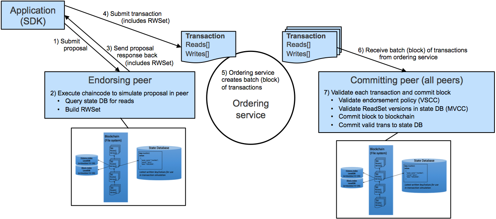

# BlockChain探究

## BlockChain概念

1. 定义：去中心化的分布式账本数据库
2. Block概念: 一次交易记录，具有时间戳
3. BlockChain： Block按照时间线性排列组成一条时间不可逆的交易记录链条

## BlockChain特点

1. 去中心化，每个参与其中的个体都是一个中心，降低信任成本，交易更高效
2. 公开化，每个人都有相同信息的记录账本
3. 交易不可逆、不易被篡改、数据加密

## Blockchain简单分类

1. 私有链
2. 公有链
3. 联盟链

## HyperLedger fabric

### HyperLedger fabric特点

1. 属于联盟链或私有链，需要知道成员的身份信息
   1. 分布式逻辑处理和协商（“链代码”）
   2. 交易订购
   3. 交易验证和提交
2. 交易流过程

   
3. 信息并不是完全公开，当对方需要知道这部分信息才能做交易时才会传递这些信息

### fabric环境安装

1. go安装

   ```bash
   wget https://storage.googleapis.com/golang/go1.8.4.linux-amd64.tar.gz
   tar -C /usr/local -xzf go1.8.4.linux-amd64.tar.gz
   echo export PATH=$PATH:/usr/local/go/bin >> /etc/profile
   echo export GOROOT=/usr/local/go >> /etc/profile
   echo export GOPATH=/home/work/go >> /etc/profile
   echo export PATH=$PATH:/home/work/go/bin >> /etc/profile
   source /etc/profile
   ```

2. docker安装

   ```bash
   curl -sSl https://get.docker.com/ | sh
   service docker start
   # 安装docker-compose
   apt-get install python-pip
   curl -L https://get.daocloud.io/docker/compose/releases/download/1.12.0/docker-compose-`uname -s`-`uname -m` > ~/docker-compose
   mv ~/docker-compose /usr/local/bin/docker-compose
   chmod +x /usr/local/bin/docker-compose
   ```

3. Fabric源码下载

   ```bash
   go get github.com/hyperledger/fabric
   mkdir -p /home/work/go/src/github.com/hyperledger
   cd /home/work/go/src/github.com/hyperledger
   git clone https://github.com/hyperledger/fabric.git
   # 切到1.0.0版本
   cd /home/work/go/src/github.com/hyperledger/fabric
   git checkout v1.0.0
   ```

4. Fabric镜像下载

   ```bash
   # 下载并执行批量下载脚本
   cd /home/work/go/src/github.com/hyperledger/fabric/examples/e2e_cli/
   source download-dockerimages.sh -c x86_64-1.0.0 -f x86_64-1.0.0
   # 检查镜像列表
   docker images
   ```

5. 启动Fabric网络并完成ChainCode的测试

   ```bash
   # 编译生成Fabric公私钥、证书的程序
   # 基于configtx.yaml生成创世区块和通道相关信息
   # 基于crypto-config.yaml生成公私钥和证书信息，并保存在crypto-config文件夹中
   # 基于docker-compose-cli.yaml启动1Orderer+4Peer+1CLI的Fabric容器
   # 在CLI启动的时候，会运行scripts/script.sh文件，这个脚本文件包含了创建Channel，加入Channel，安装Example02，运行Example02等功能
   bash network_setup.sh up

   # 手动测试一下Fabric网络，查询a账户余额，余额应该为90
   docker exec -it cli bash
   peer chaincode query -C mychannel -n mycc -c '{"Args":["query","a"]}'

   # 把a账户的余额再转20元给b账户
   peer chaincode invoke -o orderer.example.com:7050  --tls true --cafile /opt/gopath/src/github.com/hyperledger/fabric/peer/crypto/ordererOrganizations/example.com/orderers/orderer.example.com/msp/tlscacerts/tlsca.example.com-cert.pem  -C mychannel -n mycc -c '{"Args":["invoke","a","b","20"]}'

   # 查询a账户余额，余额应该为70
   docker exec -it cli bash
   peer chaincode query -C mychannel -n mycc -c '{"Args":["query","a"]}'
   ```